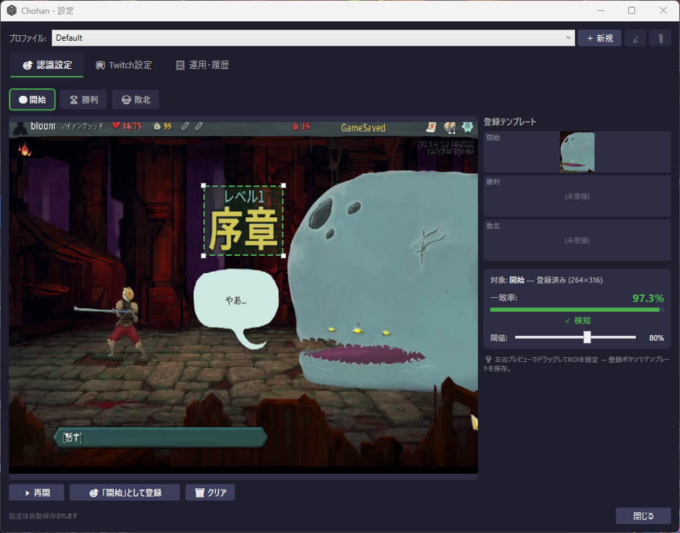
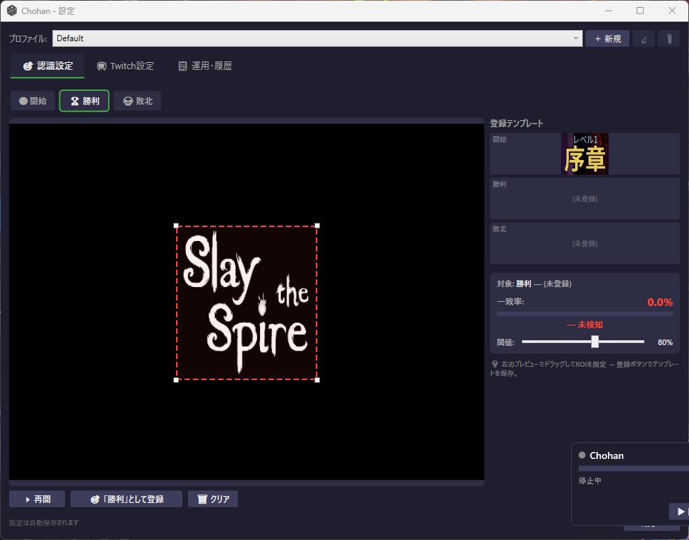
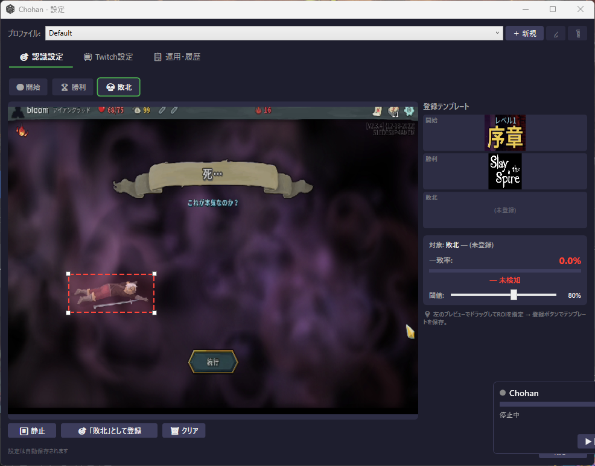
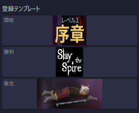

# Chohan - Twitch Prediction Auto-Manager

**「Chohan」** は、Twitch配信での「チャンネルポイント予想（賭け機能）」を、OBS Studioと画面認識（AI）を使って**完全に自動化**するツールです。

配信者が対戦に集中している間、本ソフトがゲーム画面から「勝利/敗北」を自動的に検知し、予測の作成から結果の確定までをすべて代行します。

> [!IMPORTANT]
> **本アプリは現在プレリリース版です。**
> 開発中のため、特にTwitch連携機能については十分なテストが行えていない可能性があります。
> 動作に不具合がある場合は、下部のフォームよりフィードバックをいただけますと大変助かります。

## 📺 OBS 仮想カメラとの連携

ゲーム画面の認識を行うために、**OBSの仮想カメラ機能**を利用してください。

1. **OBSの設定**: OBS右下のコントロールパネルにある「仮想カメラの開始」をクリックします。
2. **Chohanでの確認**: 本アプリの設定>認識設定からOBSの映像が正しく取り込まれているかを確認してください。

## 🔑 Twitch API 連携セットアップ

Chohan は Twitch の「予測（Prediction）」機能と連携し、画面認識の結果に応じて自動で投票の作成・確定・キャンセルを行います。
この機能を使うには、Twitch 開発者コンソールでアプリケーションを登録し、Client ID と Client Secret を取得する必要があります。

### 前提条件
- Twitch アカウントを持っていること
- Twitch アカウントで **二要素認証（2FA）が有効** になっていること
  （有効にしていない場合、開発者コンソールでアプリ登録ができません）

### 手順 1: Twitch 開発者コンソールにアクセス
1. ブラウザで [https://dev.twitch.tv/](https://dev.twitch.tv/) を開きます。
2. 右上の **「Log in with Twitch」** をクリックし、Twitch アカウントでログインします。
3. ログイン後、右上のアカウント名をクリックし **「Your Console」** を選択します。
   - または直接 [https://dev.twitch.tv/console](https://dev.twitch.tv/console) にアクセスします。

### 手順 2: アプリケーションを登録する
1. コンソール画面の **「Applications」** タブを選択します。
2. **「+ Register Your Application」** ボタンをクリックします。
3. 以下の情報を入力します:

| 項目 | 入力内容 |
|---|---|
| **Name** | 任意の名前（例: `Chohan_Project`） |
| **OAuth Redirect URLs** | `http://localhost:8080/callback/` |
| **Category** | `Application Integration` |

> [!WARNING]
> **OAuth Redirect URLs は正確に入力してください。**
> 末尾のスラッシュ (`/`) も含めて `http://localhost:8080/callback/` と入力します。アプリ内のリダイレクト先と一致しないと認証が失敗します。

4. **「Create」** ボタンをクリックします。

### 手順 3: Client ID と Client Secret を取得する
1. 作成したアプリケーションの **「Manage」** ボタンをクリックします。
2. **Client ID** が表示されるので、コピーして控えておきます。
3. **「New Secret」** ボタンをクリックして Client Secret を生成します。
4. 表示された **Client Secret** をコピーして**安全な場所に保存**してください。

> [!CAUTION]
> **Client Secret は一度しか表示されません。** 画面を閉じると再表示できず、再生成が必要になります。また、再生成すると古い Secret は無効になります。
> **絶対に他人に共有したりしないでください。**

### 手順 4: Chohan アプリに設定する
1. Chohan を起動し、右クリックメニューから **「⚙ 設定...」** を開きます。
2. **「📺 Twitch設定」** タブを選択します。
3. 手順 3 でコピーした **Client ID** と **Client Secret** を入力します。
4. **「🔗 Twitchで認証する」** ボタンをクリックします。
5. ブラウザが自動で開き、Twitch の認証画面が表示されるので **「Authorize（認証する）」** をクリックします。
6. 認証が完了すると、Chohan の画面に **緑色の接続状態** が表示されます。

#### 要求されるスコープ（権限）
Chohan が Twitch に要求する権限は以下の2つのみです。これらは予測の読み取りと、結果の自動確定のために使用されます。
- `channel:read:predictions`
- `channel:manage:predictions`

## 📸 設定の実例：Slay the Spire

Slay the Spireで自動的に予測を作成・処理するための設定例です。他にも様々な設定が考えられると思うので、自分がやりやすい方法・誤認識が少ない方法を試してみてください。

### ① 開始画面（予測の作成）

プレイ開始時の「レベル1 序章」をターゲットにします。

* **ターゲット**: 画面中央上部に出現する **「レベル1 序章」** 周辺を指定。
* **動作**: プレイの開始を検知して、自動でTwitchの予測（どちらが勝つか？）を開始します。

### ② 勝利画面（結果：勝ち）

勝利後に流れるスタッフロールをターゲットにします。

* **ターゲット**: スタッフロール開始時に大きく表示されるゲームロゴを範囲に指定。
* **動作**: 自動で「勝ち」として結果を確定させます。

### ③ 敗北画面（結果：負け）

敗北時の「倒れているアイアンクラッド」をターゲットにします。敗北時に表示されるテキストのような、プレイごとに毎回変わってしまうものをターゲットにはしないように注意が必要です。

* **ターゲット**: 画面左の **倒れているアイアンクラッド** を囲みます。
* **動作**: 自動で「負け」として結果を確定させます。

### 最終的な登録テンプレート例
最終的な登録例は以下のようになります。

## 🚀 導入手順

### 1. ダウンロード
右側の **[Releases](https://github.com/b-bloom99/Chohan/releases)** から最新の `Chohan_v1.x.x_win-x64.zip` をダウンロードし、すべて展開してください。

### 2. 起動
展開されたフォルダ内の **`Chohan.App.exe`** を実行します。
* *※「WindowsによってPCが保護されました」と出た場合は、「詳細情報」→「実行」をクリックしてください。*

### 3. 初期設定
1. **認識設定**: 上記の実例を参考に、各画面の認識範囲を指定してください。
2. **Twitch連携**: 上記に手順に従って、Twitchアカウントと連携してください。その後、作成される予測のタイトル、ラベルなどを必要に応じて設定してください。
3. **常時投票モード**: 開始画面なしで常に投票を行いたい場合、常時投票モードをONにしてください。 

## 🛠 動作要件
* Windows 10 / 11 (64bit)

## 📥 バグ報告・ご意見はこちら
GitHubのアカウントをお持ちでない方や、使い方がわからない方は、以下の専用フォームよりお気軽にご報告ください。

👉 バグ報告・フィードバックフォーム: https://forms.gle/qXuGBirFKezmUC4T9